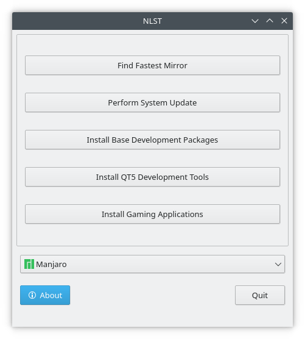

# New Linux Setup Tool

## Change Log
* 14 Jan 2021 - This application is currently being rewritten in Vala and GTK+, QT version for archive only

Small application for the purpose of helping me set up new linux installs as well as learn c++ a bit

QT 5.14
Qmake

Working on adding support for more distributions and cleaning up

